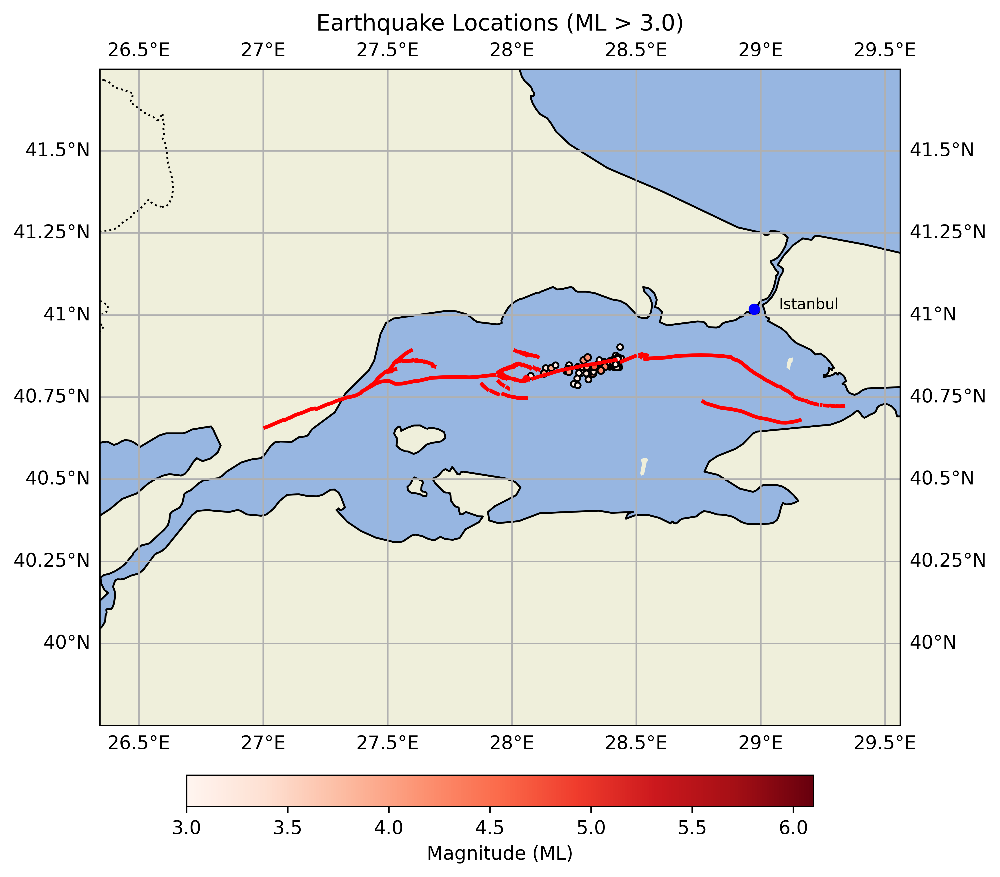
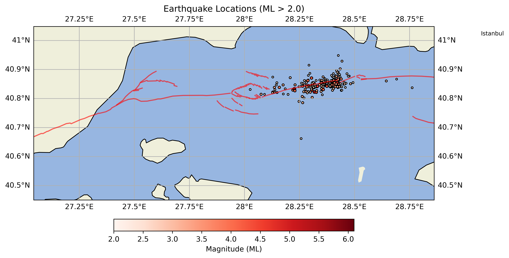

## 🌍 Earthquakes in Istanbul

A lightweight tool to visualize recent earthquakes and fault lines in Istanbul on the map, using data from the Kandilli Observatory and Earthquake Research Institute (KOERI). 
Designed to highlight seismic activity since April 23, 2025, with optional scraping from the live KOERI server.

⚙️ Features

- 📅 Earthquake list in Marmara region, starting from 23.04.2025
- 🌐 Live scraping from KOERI server (on demand)
- 🗺️ Map-based visualization using Cartopy
- 🔐 Uses local CSV to prevent unnecessary polling
- 🗺️ Integrated MTA fault line maps of area of interests (digitization of existing high quality maps in geoJson format)

🚀 **Getting Started**

Manage your environment with Micromamba – a fast and minimal environment manager.

🛠️ **Setup Instructions**
  
1. micromamba create --name earthquake_env python=3.12
2. micromamba activate earthquake_env
3. pip install -r requirements.txt  

▶️ **Run the App**

**Optional: update local earthquake list**  
> python scrape_recent_earthquakes.py  

**Process and visualize earthquakes**  
> python process_earthquakes.py  

🧱 **Next Steps**

- 💾 Improve CSV update mechanism

🛠️ **How to generate geoJson from image based fault maps?**

- QGIS is a nice tool to apply georeferencing based on coordinates given in the fault maps
- You can then draw line segments and export these segments in geoJson format to be able to plot on your map
- For further reference you can check the MTA website for fault maps and QGIS documentation for digitization of rasters

## 🌐 Turkce aciklama
# 🌍Istanbul'daki Son Depremler Haritası

Kandilli Rasathanesi veri tabanından alınan ve 23 Nisan 2025 sonrası İstanbul’daki depremleri ve varolan diri fay hatlarini gösteren interaktif bir harita uygulamasıdır. Veri çevrimdışı olarak tutulmakta, ancak istenirse anlık olarak güncellenebilmektedir.

🧱 Planlanan Geliştirmeler:
- 💾 Veri güncellemelerinin otomatik hale getirilmesi
