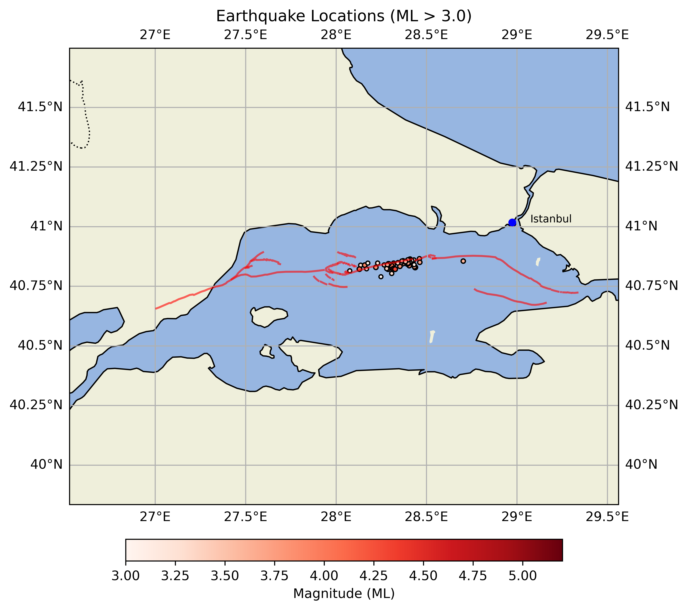

Developed to plot earthquakes in Istanbul(particularly starting with 23.04.2025) using offline data manually fetched from koeri.boun.edu.tr to prevent frequent polling from server.

I suggest that you manage python environment using micromamba, A lightweight environment manager
After creating and activating the environment, use requirements.txt to install required packages.

Steps to reproduce:  
  
- conda create --name earthquake_env python=3.12  
- conda activate earthquake_env  
- pip install -r requirements.txt  
- python process_earthquakes.py  
  
**Latest map of earthquakes in istanbul:**  

